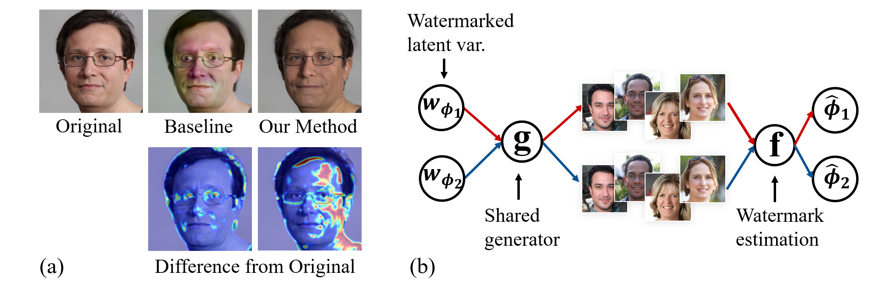

## Attributing Image Generative Models using Latent Fingerprints(LDM repository)


**Abstract:** Generative models have enabled the creation of contents that are indistinguishable from those taken from nature. 
Open-source development of such models raised concerns about the risks of their misuse for malicious purposes.
One potential risk mitigation strategy is to attribute generative models via fingerprinting. 
Current fingerprinting methods exhibit a significant tradeoff between robust attribution accuracy and generation quality while lacking design principles to improve this tradeoff. 
This paper investigates the use of latent semantic dimensions as fingerprints, from where we can analyze the effects of design variables, including the choice of fingerprinting dimensions, strength, and capacity, on the accuracy-quality tradeoff.
Compared with previous SOTA, our method requires minimum computation and is more applicable to large-scale models. We use StyleGAN2 and the latent diffusion model to demonstrate the efficacy of our method.

## Prerequisites

- NVIDIA GPU + CUDA 10.1 or above
- Python 3.7 or above
- pytorch 1.11 or above
- Anaconda recommended
- To install the other Python dependencies using anaconda, run `conda env create -f environment.yaml`.

## Checkpoints

We experiment on FFHQ only for LDM model
Checkpoints can be downloaded below.\
Make checkpoint folder in src folder and put weights under src/checkpoint/.\
Pretrained Weights:\
[FFHQ](https://ommer-lab.com/files/latent-diffusion/ffhq.zip)\
More info can be found on official [LDM](https://github.com/CompVis/latent-diffusion) repo

### Get the models

Running the following script downloads und extracts all available pretrained autoencoding models.   
```shell script
bash scripts/download_first_stages.sh
```

The first stage models can then be found in `models/first_stage_models/<model_spec>`

## Generate and attribute fingerprinted image

- Run, e.g.,
  ```
  python ./scripts/3D_watermarking.py --model sg2 --save_dir '../result/' --key_len 64 --sigma 1 --shift 448
  ```
  where
- `save_dir`: Directory for output saving
- `key_len`: Digits of binary key, higher key length will increase the key capacity. For key length = 64, the key capacity would be 2^64
- `sigma` : Fingerprint perturbation strength
- `shift` : Initial index of consecutive principal axis ranked from a descent order based on it's corresponding variance. 
- `step`: optimization steps to attribute fingerprinted image
- `sample_size`: number of attribution tests user would like to perform
- `n`: Number of initial guess from Latin Hypercube sampling method
E.g. the set of editing direction V follows V = PC[shift:shift+key_len]  
After running the code, fingerprinted images will be saved under result folder. 


## Note:
-PCA needs to be precomputed by 'PCA_calculate.py'. Or download from [here](https://drive.google.com/file/d/1iWfIX7zRl4bwzif_SRqPOlFsp8b4jm_D/view?usp=sharing)\
-1D_watermarking.py use single RGB channel as latent, while 3D_watermarking.py use all RGB channel as latent and embed same key across all three channel.
-StyleGAN2 version can be found [here](https://github.com/GuangyuNie/Attributing-Image-Generative-Models-using-Latent-Fingerprints/tree/refactor)

## Acknowledgement:
-This repo implement an intrinsic watermarking module based on pretrained LDM model. For more information regarding the LDM itself, check their official github repo [here](https://github.com/CompVis/latent-diffusion)
